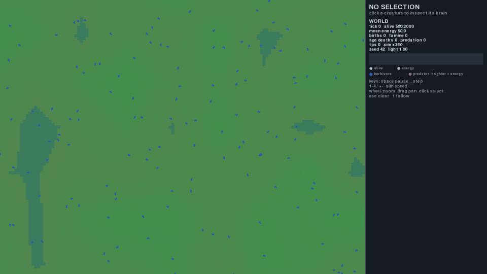
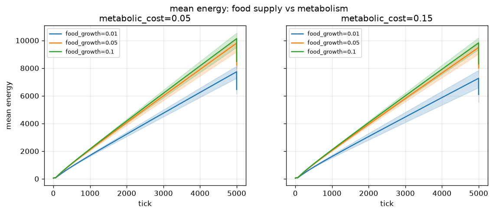
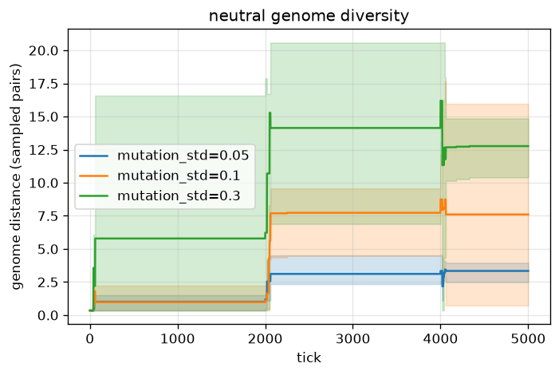
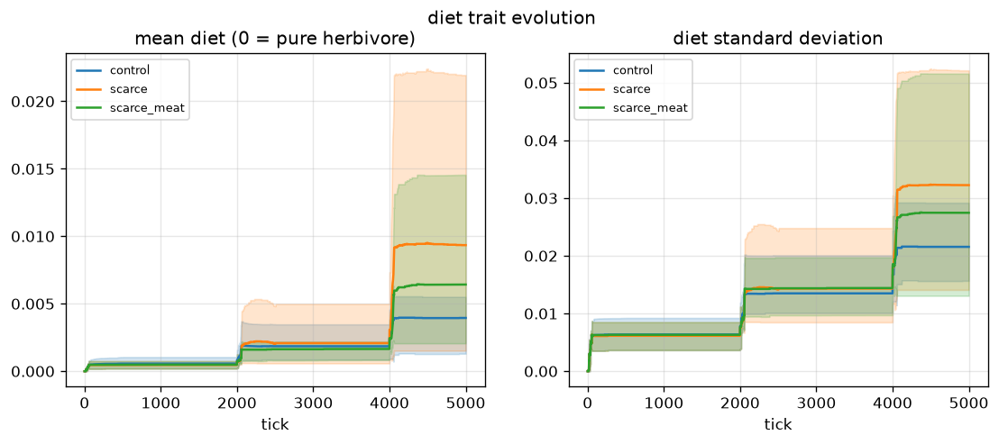

# Primordia



**A 2D ecosystem where neural creatures evolve by natural selection — there is
no fitness function anywhere.** Creatures that survive and accumulate energy
split in two; creatures that starve, age out, or get bitten die. Predation,
flocking, and herding are not programmed — either they emerge from selection
on the evolved body/brain traits, or they don't. This repo is an honest
attempt to find out which, with reproducible experiments and published
negative results.

```bash
pip install -e ".[render,dev]"
python run.py --seed 42                # windowed viewer
python run.py --seed 42 --headless --ticks 5000 --stats s42.npz
pytest -q
```

## How it works

- **No fitness, no objectives.** Energy is the only currency: eat food (or
  meat), pay metabolic and movement costs, and split when you cross
  `reproduce_threshold`. Death = energy ≤ 0, `max_age`, or a predator's bite.
- **Evolvable body and brain.** Each creature is a genome of 427 values: a
  28-input network (7-ray food sum, creatures and food peak channels, three
  smells, left/right food antennas, internal state) → 10 hidden units with
  Elman recurrence → turn, accelerate, eat/attack — plus body traits: max
  speed, size, vision range, and *diet* (0 = herbivore; predation capability
  is itself a trait that has to evolve).
- **Headless core, one-way rendering.** The core modules (`world`, `step`,
  `brain`, `genome`, `sensors`, `stats`, `io`) never import pygame or
  matplotlib; the viewer only reads state.
- **Deterministic.** Same `--seed` ⇒ bit-identical simulation on the same
  machine, including across save/load (`--save`/`--load` restore both RNG
  streams and the genealogy log).
- **Data-oriented.** Fixed-capacity SoA arrays with a free-list — no Python
  objects per creature, no allocation in the tick, spatial-hash neighbor
  queries, everything hot in Numba `@njit`.

## What I discovered

These are the results of the stage-8 experiments
([`experiments/`](experiments/)), 3 seeds × 5000 ticks each. Full method and
limitations in each experiment's README.

> **Reproducibility note.** The tables and figures below were produced on the
> pre-stage-9 tree (19-input, 12-hidden feedforward brains, uniform food
> field, the old food economy). Stage 9 changed the brain layout (28 inputs,
> 10 hidden units, Elman recurrence) and stage 9.5 recalibrated the economy
> (the experiment scripts pin the stage-8 values via `STAGE8_BASE` so the
> *regime* is preserved). The scripts reproduce the *protocol* on current
> HEAD — trajectories land on different numbers; the original runs stay in
> each experiment's gitignored `data/` cache.

### 1. Energy grows without a ceiling — and the obvious knobs don't fix it

A 6-point sweep of `food_growth_rate {0.01, 0.05, 0.10}` ×
`metabolic_cost {0.05, 0.15}` left the population pinned at the cap in every
variant and mean energy climbing linearly (~1.43–1.87 e/tick). Root cause:
while the population sits at `max_creatures`, blocked reproduction costs the
parent nothing, so metabolism + movement are the only energy sinks and they
lose against intake. The knobs only change the slope, never the structure.



**Fix decided before publishing:** `max_age` 5000 → 2000. Continuous age
turnover frees slots, reproduction and mutation keep running all run long,
and mean energy settles into a bounded ~1000–4000 cycle instead of growing
without limit (~4400 age deaths and births per run instead of one cliff at
the final tick).

**Stage 9.5 follow-up:** the missing knob was the *scale* of the food
economy, not its slope — `food_capacity` 100 → 3, `eat_rate` 4 → 1,
`food_growth_rate` 0.05 → 0.02, `metabolic_cost` 0.05 → 0.08. Offer now
matches demand: over 10k ticks the population sits at mean 1342–1734 with
minima of 185–295 (below the 2000 cap), famine is the second death cause
(11–27% of deaths), and only 1–32% of survivors sit above the reproduction
threshold at any time. Selection finally has something to act on.

### 2. Mutation controls spread, not direction

Sweeping `trait_mutation_std {0.05, 0.10, 0.30}` moves final sampled genome
distance **3.34 → 7.60 → 12.77** monotonically with no viability cost, but
trait *means* barely move (±1%). Over this window what we measure is
evolutionary **drift**, not directional selection — and diversity only grows
in steps, at the turnover pulses, because mutation happens at birth.



### 3. Predation did not emerge (negative result)

Starting from an all-herbivore population (diet = 0 at spawn), neither food
scarcity nor a richer meat reward produced meaningful predation: diet_mean
stays ≤ 0.0093 and predation kills **0 / 3 / 2 per run** against ~4000
old-age deaths. The likely trap: bite budget is `bite_rate × diet`, so near
diet ≈ 0 meat cannot pay for itself, and diet cannot grow without meat
paying. Publishing this as-is — an honest negative beats a cherry-picked
gif.

*Stage 9.5 update:* with the scarcer economy (and a steak now worth more
relative to a shrinking energy budget), predation first went nonzero: every
one of 3 seeds × 10k ticks records predation deaths (1–64 per run), and the
top 1% of evolved diets reach 0.17–0.22. Still a trickle, not a food web —
the trophic-cascade stage (12) is where this gets a real test.



### 4. A few families dominate the survivors

With `max_age = 2000` turnover, ~5600 births per run come in sharp pulses
(synchronized cohorts refilling LIFO-freed slots). Of the 500 founders only
**49–56 families** survive to tick 5000, and the **top 10 account for 74–77%
of the population**; median lineage depth 6–7 generations.


## Viewer

`python run.py --seed 42` opens the pygame-ce window: drag to pan, wheel to
zoom, click a creature to inspect its brain (per-layer weights including
the recurrent matrix, firing activity), space to pause, `1-4` to change sim
speed. The camera follows the selection with a trail, births and deaths
flash in place, and the side panel shows population, births, deaths by
cause, and mean energy live (sparkline in overview mode).

## Performance

Target: ≥ 30 ticks/s at 2000 creatures headless (i5-8265U, no GPU).

| creatures | ticks/s (load 2–5, stage 9.5 economy) |
|---|---|
| 500 | 989 |
| 2000 | 870 |
| 5000 | 321 |

Numbers vary 2–4× between processes depending on machine load (this box runs
a desktop session); compare A/B in the same session. The stage-9.5 economy
keeps populations below the cap during a 1000-tick bench (alive_final
296/1087/1335), so these are not directly comparable to earlier tables.
`python -m primordia.bench [--profile]` reproduces the table.

## Reproduce everything

```bash
# experiments (data/ cached in npz, figures regenerate)
python experiments/food_supply/run.py
python experiments/mutation_diversity/run.py
python experiments/predation/run.py
python experiments/lineage/run.py

# stats + plots
python run.py --seed 42 --headless --ticks 5000 --stats s42.npz
python plot.py s42.npz --out figs/

# save / load (bit-identical continuation)
python run.py --seed 42 --headless --ticks 5000 --save w5k.npz
python run.py --load w5k.npz --headless --ticks 500

# demo GIF (what you see at the top of this README)
python run.py --seed 42 --headless --ticks 9000 \
    --record docs --record-every 360

# JSON config overrides (copy overrides.example.json and edit fields;
# unknown field names are rejected loudly)
python run.py --headless --ticks 1000 --config overrides.example.json
```

## Project layout

```
primordia/
  config.py   world.py   genome.py   brain.py   sensors.py
  step.py     stats.py   io.py       bench.py
  render/     # pygame viewer + headless GIF recorder (never imported by core)
tests/        # 76 tests: determinism, invariants, save/load, guards
experiments/  # one script + README per experiment
run.py        # CLI: --seed --headless --ticks --load --save --stats
              #      --config --record --screenshot --select
```

## Roadmap status

Stages 1–9.5 of the plan are implemented: world+food, brain+sensors,
genome+reproduction, viewer, evolvable predation, stats/plots,
save/load+genealogy, experiments/demo/publication, the guided-world stage
(persistent food patches, richer senses, Elman recurrence, a richer
viewer), and the balance stage (food economy recalibrated, turning now
costs energy, larger sprites). The "real world" roadmap continues with
stage 10 (terrain/seasons/light), 11 (biology), 12 (ecology), 13–16
(civilization+). Known open problems are documented above (predation still
a trickle, creatures still circle) rather than hidden.

## License

MIT — see [LICENSE](LICENSE).
