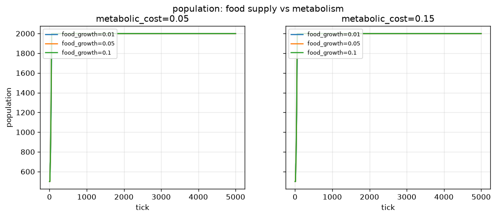
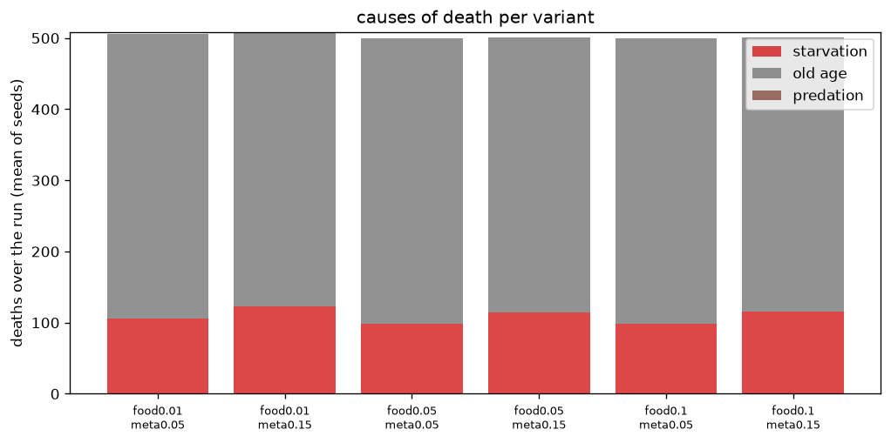

# Food supply vs. metabolic cost

## Question

Can cheaper food or a higher metabolic bill tame the unbounded mean-energy
growth observed in stage 6 (energy 52 -> ~8000 over 5000 ticks with
`deaths_predation = 0`), or push the population off its `max_creatures`
ceiling?

## Method

Full factorial `food_growth_rate {0.01, 0.05, 0.10}` x
`metabolic_cost {0.05, 0.15}` (0.05/0.05 are the current defaults), 3 seeds
(42, 7, 13), 5000 ticks each, per-tick stats recorded.

```bash
python experiments/food_supply/run.py          # uses data/ cache
python experiments/food_supply/run.py --force  # recompute
```

## Result





| variant | final pop | final mean energy | starvation | old age | predation | final diet mean |
|---|---|---|---|---|---|---|
| food0.01_meta0.05 | 2000 | 6455 | 105 | 400 | 0 | 0.0007 |
| food0.01_meta0.15 | 2000 | 6095 | 123 | 386 | 0 | 0.0006 |
| food0.05_meta0.05 | 2000 | 8208 | 99 | 401 | 0 | 0.0008 |
| food0.05_meta0.15 | 2000 | 8000 | 115 | 386 | 0 | 0.0008 |
| food0.1_meta0.05 | 2000 | 8490 | 99 | 401 | 0 | 0.0008 |
| food0.1_meta0.15 | 2000 | 8304 | 115 | 386 | 0 | 0.0007 |

(Columns `starvation`/`old age`/`predation` are the mean total deaths per
run over the 3 seeds.)

Findings:

1. **Population is identical in every variant**: 500 -> 2000 within ~200
   ticks, then pinned at the cap for the rest of the run. Neither knob moves
   it.
2. **Mean energy grows linearly without bound in every variant**. Only the
   slope changes: ~1.43 e/tick at `food_growth_rate=0.01` vs ~1.87 e/tick at
   `0.10`; tripling `metabolic_cost` (0.05 -> 0.15) shifts the final mean by
   only ~200 energy (0.04 e/tick) — second-order next to food supply.
3. **Almost nothing dies.** Per run: ~100 famine deaths over 5000 ticks,
   0 predation deaths, and an `old age` column dominated by the tick-5000
   cliff — every creature still alive hits `max_age = 5000` at exactly the
   end of the run, so that column mostly measures run length, not steady-state
   mortality.

## Why (mechanism)

With the population at `max_creatures`, `_reproduce` skips every parent when
`free_count <= 0` **without charging energy** (`primordia/genome.py`, free-slot
check). So after tick ~200 the only energy sinks are `metabolic_cost` and
`move_cost * speed^2`, both smaller than food intake for essentially every
creature: energy must grow linearly. Food and metabolic parameters only tune
the slope; they cannot change the structure while there is no turnover.

## Limitations

- One 5000-tick window; the tick-5000 `max_age` cliff would become continuous
  turnover in longer runs (`max_age = 5000` = run length here).
- Ranges tested are moderate; more extreme values (e.g.
  `food_growth_rate = 0.002`, `metabolic_cost = 0.5`) were not swept.
- Predation stays inert (`diet_mean <= 0.0009`), so this experiment says
  nothing about trophic dynamics; that is `experiments/predation`'s
  question.

## Follow-up (balance decision)

Because neither knob changes the structure, the balance decision targeted
the root cause instead: the `Config.max_age` default moved **5000 -> 2000**.
With continuous age turnover, slots free up, reproduction and mutation stay
active for the whole run, and mean energy is bounded in a ~1000-4000 cycle
(final 3381/3029 on seeds 42/7) instead of growing without limit (7669/8397
and rising). The sweep above was run under the old default and is not
repeated here; these results document the sweep as run.

## Reproducibility

Numbers and figures here were produced on the pre-stage-9 tree (19-input,
12-hidden feedforward brains on a uniform food field, `max_age = 2000`).
Stage 9 changed the brain layout (28 inputs, 10 hidden units, Elman
recurrence) and added food patches, which the scripts pin back to a uniform
field via `STAGE8_BASE`. Reruns therefore follow the same protocol but land
on different trajectories; the original runs live in the gitignored `data/`
cache.
