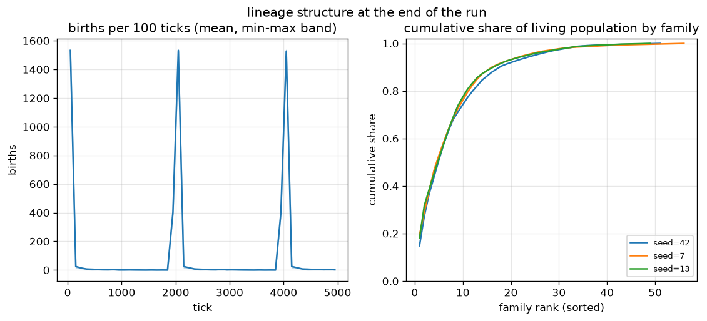

# Lineage structure of the surviving population

## Question

Under `max_age = 2000` turnover, who survives? Is the living population
descended from a few founder families, how deep does the family tree get,
and when do births happen?

## Method

Defaults, 3 seeds (42, 7, 13), 5000 ticks. Each run caches the
append-only genealogy log `(tick, child_id, parent_id)` plus the final
alive ids in `data/` (gitignored); every living creature is traced back to
its founder through the parent map.

```bash
python experiments/lineage/run.py          # uses data/ cache
python experiments/lineage/run.py --force  # recompute
```

## Result



| seed | births | alive | families | top-10 share | max depth | median depth | overflow |
|---|---|---|---|---|---|---|---|
| 42 | 5602 | 2000 | 51 | 0.743 | 11 | 7 | 0 |
| 7 | 5600 | 2000 | 56 | 0.761 | 12 | 7 | 0 |
| 13 | 5603 | 2000 | 49 | 0.774 | 12 | 6 | 0 |

1. **Births come in sharp pulses** (~1500 per pulse): the synchronized
   cohorts born at tick ~0, ~2000 and ~4000 die together when they hit
   `max_age`, and the freed slots are refilled in the same window. A
   small trickle of births between pulses comes from famine deaths.
2. **Family dominance is strong**: of the 500 founders, only **49-56
   families** remain among the 2000 survivors (~90% of founder lines
   extinct in 5000 ticks), and the **top 10 families account for
   74-77%** of the living population — with nearly identical curves
   across all three seeds.
3. **The tree is shallow but growing**: median depth 6-7 generations,
   max 11-12, consistent with ~3 birth pulses plus the famine trickle.
4. The birth log stayed far inside its buffer (`overflow = 0`; capacity
   100k vs ~5600 rows).

Likely mechanism for the concentration (from the code, not isolated
here): `_reproduce` scans parents in ascending slot order while popping
free slots LIFO, so at a pulse every slot goes to the lowest-index
eligible parents — early-slot families refill the world first.

## Limitations

- One config: family structure under different `max_age` /
  `reproduce_threshold` settings is unknown.
- "Family" = shared founder via the asexual parent chain; there is no
  recombination, so family ≈ genotype lineage.
- The slot-order hypothesis for concentration was not tested
  independently (e.g. by shuffling the reproduction scan order).
- 5000 ticks cover only ~3 turnover pulses; deeper trees need longer
  runs.

## Reproducibility

Numbers and figures here were produced on the pre-stage-9 tree (19-input,
12-hidden feedforward brains on a uniform food field, `max_age = 2000`).
Stage 9 changed the brain layout (28 inputs, 10 hidden units, Elman
recurrence) and added food patches, which the scripts pin back to a uniform
field via `STAGE8_BASE`. Reruns therefore follow the same protocol but land
on different trajectories; the original runs live in the gitignored `data/`
cache.
