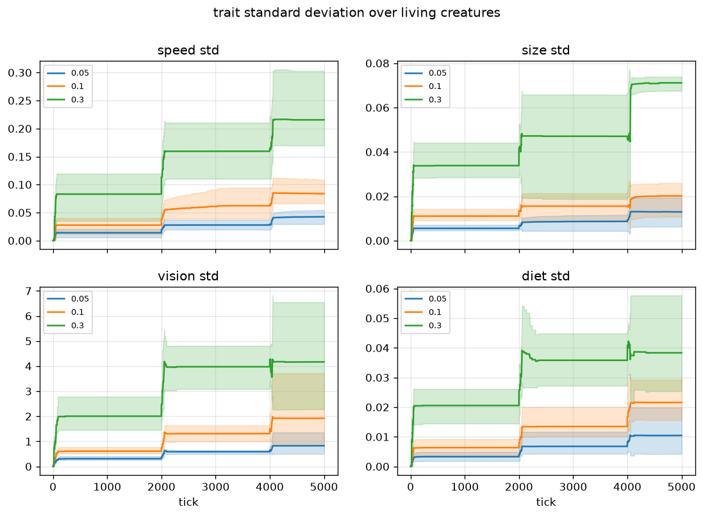
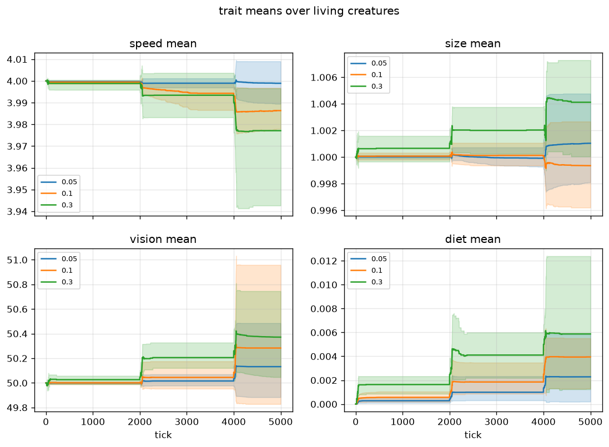

# Trait mutation rate vs. evolutionary diversity

## Question

Does `trait_mutation_std` control how much diversity the population
maintains — and does pushing it to 3x the default hurt viability?

## Method

`trait_mutation_std {0.05, 0.10, 0.30}` (0.10 is the default), 3 seeds
(42, 7, 13), 5000 ticks, defaults otherwise (`max_age = 2000`), per-tick
stats recorded.

```bash
python experiments/mutation_diversity/run.py          # uses data/ cache
python experiments/mutation_diversity/run.py --force  # recompute
```

## Result





| variant | final pop | final mean energy | genome_dist | vision_std | diet_mean |
|---|---|---|---|---|---|
| mut0.05 | 2000 | 3216 | 3.339 | 0.825 | 0.0023 |
| mut0.1 | 2000 | 3202 | 7.604 | 1.920 | 0.0039 |
| mut0.3 | 2000 | 3129 | 12.765 | 4.168 | 0.0059 |

1. **Diversity scales strongly and monotonically with the mutation
   rate**: final sampled genome distance 3.34 -> 7.60 -> 12.77 and
   `vision_std` 0.83 -> 1.92 -> 4.17 — roughly doubling per step while
   the rate doubles/quintuples.
2. **Diversity only moves at turnover pulses.** Every curve is flat
   between ticks ~2000 and ~4000 and jumps when the synchronized cohorts
   die and are replaced: mutation happens at birth only, so under
   `max_age = 2000` evolutionary change is stepwise, not smooth.
3. **Viability is unaffected at 0.30**: population 2000 and mean energy
   ~3100-3200 in all three variants.
4. **Trait means barely move** (speed 4.000 -> 3.977, vision 50.0 ->
   50.4, size ~1.000, diet 0 -> 0.006): within +/-1%. What the mutation
   rate controls here is *spread*, not direction — we observe drift, not
   measurable directional selection, over this window.

## Limitations

- Three settings, one 5000-tick window (only ~2 turnover pulses);
  longer runs could reveal directional selection currently hidden in the
  seed bands.
- `genome_dist` is dominated by neutral body-trait spread; it does not
  separate adaptive from neutral diversity.
- No recombination (asexual budding), so genome distance accumulates
  directly from mutation load.

## Reproducibility

Numbers and figures here were produced on the pre-stage-9 tree (19-input,
12-hidden feedforward brains on a uniform food field, `max_age = 2000`).
Stage 9 changed the brain layout (28 inputs, 10 hidden units, Elman
recurrence) and added food patches, which the scripts pin back to a uniform
field via `STAGE8_BASE`. Reruns therefore follow the same protocol but land
on different trajectories; the original runs live in the gitignored `data/`
cache.
