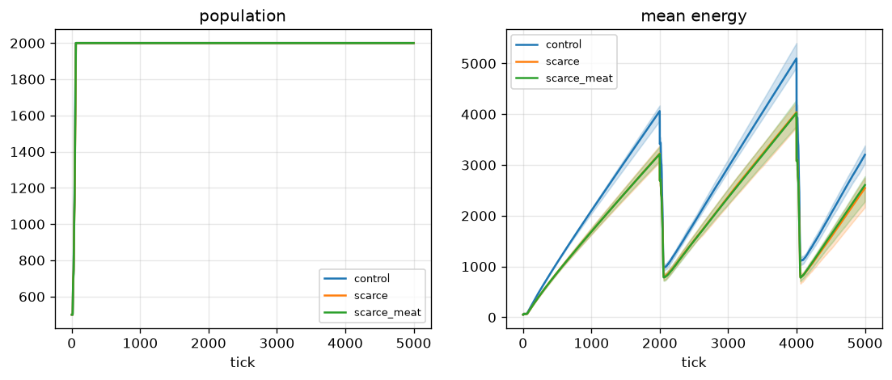
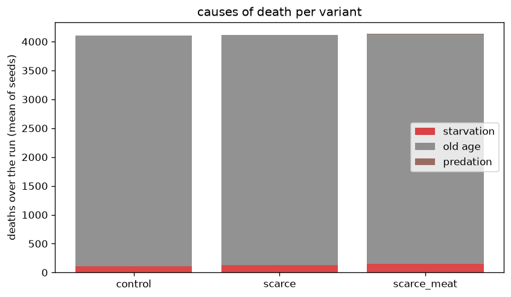

# Can predation emerge under adverse conditions?

## Question

Starting from an all-herbivore population (spawn sets `diet = 0`; diet can
only reach meat through additive mutation), does any honest pressure —
scarce food alone, or scarce food plus a richer meat reward — produce
`diet > 0` that matters and predation deaths?

## Method

3 configs x 3 seeds (42, 7, 13) x 5000 ticks, per-tick stats recorded:

| variant | overrides |
|---|---|
| control | none (food_growth_rate 0.05, bite_efficiency 0.7) |
| scarce | food_growth_rate 0.01 |
| scarce_meat | food_growth_rate 0.01, bite_efficiency 0.95 |

```bash
python experiments/predation/run.py          # uses data/ cache
python experiments/predation/run.py --force  # recompute
```

## Result





| variant | final pop | max diet_mean | final diet_mean | starvation | old age | predation |
|---|---|---|---|---|---|---|
| control | 2000 | 0.0042 | 0.0039 | 107 | 3995 | 0 |
| scarce | 2000 | 0.0095 | 0.0093 | 130 | 3987 | 3 |
| scarce_meat | 2000 | 0.0066 | 0.0064 | 153 | 3978 | 2 |

(Death columns are mean totals per run over the 3 seeds.)

**Honest negative result: predation did not meaningfully emerge.**

1. **Diet leaves zero everywhere** (mutation is additive and must be able
   to escape 0) and food scarcity roughly doubles it — but `diet_mean`
   stays <= 0.0093, and the seed bands overlap heavily.
2. **Predation deaths: 0 / 3 / 2 per run** against ~4000 old-age deaths
   — statistically nothing. Raising `bite_efficiency` to 0.95 did *not*
   help (2 vs 3 deaths).
3. **Pressure is real but not meat-shaped**: scarce configs starve more
   (107 -> 130/153 deaths), population stays pinned at 2000, and mean
   energy follows the bounded sawtooth cycle (crashes at the tick-2000
   and tick-4000 turnover pulses) at a lower plateau than the control.
4. **Likely mechanism for the trap** (hypothesis, from the code, not
   measured here): the bite budget is `bite_rate * gate * diet`, so at
   `diet ~ 0.01` a bite drains ~0.04 energy/tick — far below foraging
   income (~1.5/tick). Meat cannot pay for itself while diet is low, and
   diet cannot grow without meat paying: a ratchet that never starts.

## Limitations

- Only two adverse pressures were tested (food scarcity, meat reward);
  other honest levers (density, `bite_rate`, `contact_range`) were not
  swept.
- 5000 ticks / 3 seeds: "3 deaths per run" could differ by an order of
  magnitude with more seeds, but would still be negligible against ~4000
  age deaths.
- The mechanism hypothesis above was not isolated experimentally (it
  would need an instrumented run measuring bite budgets per tick).
- `max_age = 2000` turnover was chosen in experiment 1 before this ran;
  predation dynamics under other turnover rates are unknown.

## Reproducibility

Numbers and figures here were produced on the pre-stage-9 tree (19-input,
12-hidden feedforward brains on a uniform food field, `max_age = 2000`).
Stage 9 changed the brain layout (28 inputs, 10 hidden units, Elman
recurrence) and added food patches, which the scripts pin back to a uniform
field via `STAGE8_BASE`. Reruns therefore follow the same protocol but land
on different trajectories; the original runs live in the gitignored `data/`
cache.
